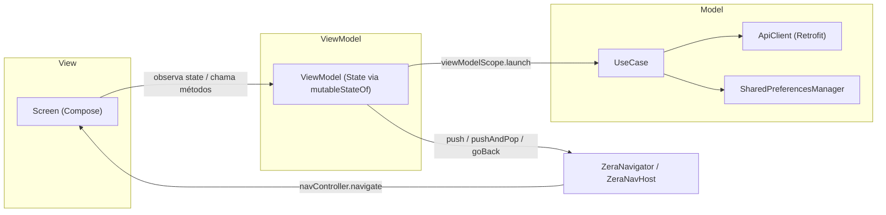

# 01 — Arquitetura

## Visão geral das camadas

O app é um módulo Android único (`:app`) organizado em três camadas, inspiradas em MVVM, mas sem os componentes de um MVVM "canônico" (não há `Repository` nem `UseCase` com interface/contrato — ver abaixo):

- **`model`** — dados e regras de acesso a dados: DTOs (`model/entity`), persistência local (`model/local`), acesso remoto via Retrofit (`model/remote`) e casos de uso (`model/usecase`).
- **`viewmodel`** — um `ViewModel` por tela (ou por feature de tela), expõe um `State` imutável via `mutableStateOf` e métodos de intenção (`onEmailChange`, `signIn`, ...). Instancia o(s) `usecase` que precisa diretamente (`val useCase = SingIn()`), sem injeção.
  - Subpasta `shared/`: `ViewModels` de telas acessadas por mais de um tipo de usuário (ex.: "Perfil", acessada tanto por Gestor quanto por Operário) — ver a mesma convenção em `view/screens/shared/` logo abaixo.
- **`view`** — Jetpack Compose puro: `screens` (telas, uma por rota, organizadas por domínio — `auth/`, `manager/`, `employee/` e `shared/` para telas comuns a mais de um tipo de usuário), `components` (Design System reutilizável — ver [03-catalogo-componentes.md](03-catalogo-componentes.md)), `navigation` (rotas e navegação), `theme` (tokens visuais) e `transition` (transições compartilhadas entre telas).

Não há camada de `Repository` separada: o `usecase` fala diretamente com `ApiClient.<service>` e com `SharedPreferencesManager`. Para o volume atual de regras isso é suficiente; se a lógica de acesso a dados crescer (ex.: cache local, múltiplas fontes), vale reavaliar (registrar a decisão em [08-decisoes-arquiteturais/](08-decisoes-arquiteturais/) quando isso acontecer).

## Separação entre View e lógica (regra estrita)

A `View` (`Screen`/componente Compose) deve ser **puramente de apresentação**: renderiza o `State` recebido e encaminha eventos de UI (`onClick`, `onValueChange`, ...) para o `ViewModel`. É **proibido implementar lógica na View** — isso inclui:

- decisões condicionais sobre dados de domínio (ex.: `if (usuario.role == "MANAGER")`);
- chamadas a `usecase`, `ApiClient` ou `SharedPreferencesManager`;
- validação de dados de negócio (validação puramente de formato de UI, como desabilitar um botão enquanto um campo obrigatório está vazio, é aceitável na View; a regra de negócio em si mora no `ViewModel`);
- disparo de navegação (`ZeraNavigator`) como reação a uma regra — a `View` só invoca `onClick`, é o `ViewModel` quem decide **para onde** navegar e **quando**.

O `ViewModel` é o único responsável por coordenar coleta de dados (inputs do usuário), envio (chamadas a `usecase`), atualização do `State` exibido e, na maioria dos casos, a navegação decorrente dessas ações (ver exemplo em `SingInViewModel.signIn()`, que decide a rota de destino a partir do `role` retornado pela API).

**Exceção conhecida, não um novo padrão a replicar:** `SplashScreen` e `WelcomeScreen` hoje não têm `ViewModel` e chamam `ZeraNavigator` diretamente na `View` (a primeira num `LaunchedEffect` com `delay`, a segunda num `onClick` de botão). Isso funciona porque não há nenhuma decisão de negócio envolvida (é navegação incondicional), mas é uma exceção à regra acima, não motivo para colocar lógica condicional nesse mesmo lugar — qualquer decisão que dependa de dado de domínio deve migrar essas telas para ter `ViewModel` próprio.

## Organização de módulos/pacotes

```
com.zera.android
├── model
│   ├── entity/           DTOs de rede (@Serializable), por domínio (auth, user, ...)
│   ├── local/             persistência local (SharedPreferencesManager)
│   ├── remote/
│   │   ├── client/        ApiClient (Retrofit + OkHttp, singleton)
│   │   └── service/       interfaces Retrofit (AuthService, SelfUserService, ...)
│   └── usecase/           regra de negócio de acesso a dados, por domínio (auth/SingIn, ...)
├── viewmodel/             um ViewModel por tela/feature, por domínio (auth/, manager/, shared/, ...)
└── view
    ├── screens/           telas Compose, por domínio (auth/, manager/, employee/, shared/) + telas soltas (SplashScreen)
    ├── components/        Design System (buttons, cards, containers, inputs, lists, navigation, texts, ...)
    ├── navigation/         Route, NavCommand, ZeraNavigator, ZeraNavHost
    ├── theme/              tokens (cores, tipografia, espaçamento, raio) + ícones
    └── transition/         SharedElement (transições compartilhadas entre telas)
```

A organização é **por camada primeiro, por domínio depois** (`model/usecase/auth`, `viewmodel/auth`, `view/screens/auth`), e não por feature verticalizada. Ao adicionar um domínio novo, siga esse mesmo padrão de subpasta.

`shared/` é um "domínio" especial para telas acessadas por mais de um tipo de usuário (ex.: "Perfil", acessada tanto por Gestor quanto por Operário) — não use os domínios `manager/`/`employee/` para esses casos, mesmo que a tela tenha sido pensada a partir de um mockup de um perfil específico.

## Fluxo de dados entre camadas

Fluxo típico de uma ação de usuário (exemplo: login, ver [viewmodel/auth/SignIn.kt](../app/src/main/java/com/zera/android/viewmodel/auth/SignIn.kt)):

1. A `Screen` (Compose) observa o `state` do `ViewModel` (`val state by viewModel.state`) e chama seus métodos em resposta a eventos de UI (`onClick`, `onValueChange`).
2. O `ViewModel` atualiza seu `State` imediatamente quando cabível (ex.: `isLoading = true`) e lança uma `viewModelScope.launch` para chamar o `usecase`.
3. O `usecase` chama `ApiClient.<service>` (Retrofit, `suspend fun`) e, quando necessário, grava/lê `SharedPreferencesManager`.
4. O resultado (sucesso ou exceção) volta ao `ViewModel`, que atualiza o `State` e, se for o caso, dispara uma navegação via `ZeraNavigator`.
5. A `Screen` recompõe automaticamente a partir do novo `State` (Compose reage a `State` via `getValue`/`by`).

O `State` de cada tela é uma `data class` imutável (`copy()` a cada mudança) guardada em `mutableStateOf` — não `StateFlow`/`MutableStateFlow`. Não há camada de mapeamento DTO → modelo de domínio: os `ViewModels` hoje consomem o DTO de rede diretamente no `State` (ex.: `SelfUserResponseDTO` usado dentro do fluxo de login). Ver [04-modelo-de-dados.md](04-modelo-de-dados.md).

## Injeção de dependência

**Não há framework de injeção de dependência** (nem Hilt, nem Koin, nem injeção manual via construtor). As dependências compartilhadas são `object` (singletons de linguagem Kotlin):

- `ApiClient` — monta o `Retrofit`/`OkHttpClient` uma única vez e expõe os `service`s (`authService`, `selfUserService`) via `by lazy`.
- `SharedPreferencesManager` — precisa ser inicializado explicitamente em `MainActivity.onCreate` (`SharedPreferencesManager.init(this)`) antes de qualquer leitura/escrita.
- `ZeraNavigator` — ponto único de comandos de navegação (ver seção seguinte).

`ViewModels` instanciam seus `usecase`s diretamente como propriedade (`val useCase = SingIn()`) e são obtidos nas `Screens` via o factory padrão do Compose (`viewModel()`), sem `Factory` customizada. Essa combinação funciona hoje porque os `usecase`s não têm dependências configuráveis além dos próprios singletons — se isso mudar (ex.: necessidade de trocar implementação em teste), vale considerar introduzir um framework de DI e registrar a decisão como ADR.

## Navegação

A navegação usa **Jetpack Navigation Compose** com rotas tipadas (`sealed interface Route`, `@Serializable`), mas o disparo de navegação **não é feito diretamente pelas telas** — é centralizado em `ZeraNavigator` (`view/navigation/ZeraNavigator.kt`), um singleton que expõe um `Flow<NavCommand>` (`Channel` por baixo) consumido uma única vez em `ZeraNavHost`.

- `ZeraNavigator.push(route)` — navega mantendo a pilha (`Navigate`).
- `ZeraNavigator.pushAndPop(route)` — substitui a tela atual pela nova (`PushAndPop`), usado por exemplo ao sair da Splash ou redirecionar após o login.
- `ZeraNavigator.pushAndPopAll(route)` — limpa toda a pilha de navegação, deixando só a nova rota (`PushAndPopAll`).
- `ZeraNavigator.goBack()` — volta uma tela (`GoBack`).

Qualquer camada (tipicamente o `ViewModel`, mas também `Screens` simples como `WelcomeScreen`) pode chamar `ZeraNavigator` diretamente, sem precisar de referência ao `NavHostController`. Isso desacopla `ViewModels` de Compose/Navigation-Compose, mas também significa que a navegação não é unit-testável isoladamente sem observar o `Flow` de comandos.

O app usa `SharedTransitionLayout` (API experimental do Compose) para animar elementos compartilhados entre telas (hoje, o logo — ver [view/transition/SharedElement.kt](../app/src/main/java/com/zera/android/view/transition/SharedElement.kt)); os escopos necessários (`LocalSharedTransitionScope`, `LocalAnimatedVisibilityScope`) são providos em `ZeraNavHost` e consumidos pelo modifier `Modifier.sharedTransition(key)`.

## Concorrência (coroutines)

`ViewModels` usam `viewModelScope.launch` para chamadas suspensas (rede). Não há uso de `Flow`/`StateFlow` para estado reativo — só para o canal de comandos de navegação (`ZeraNavigator.commands`). Não há dispatchers customizados explícitos; as chamadas Retrofit (`suspend fun`) já fazem I/O fora da main thread pelo próprio Retrofit/OkHttp.

## Diagrama (mermaid)


